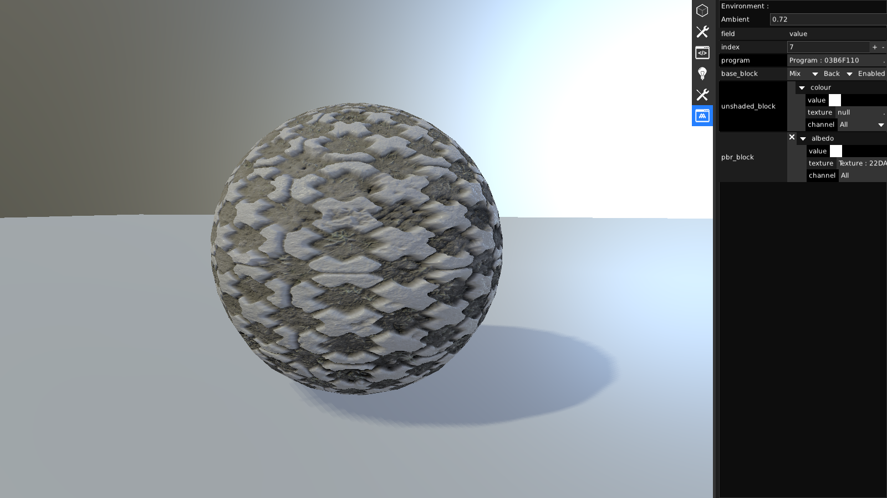
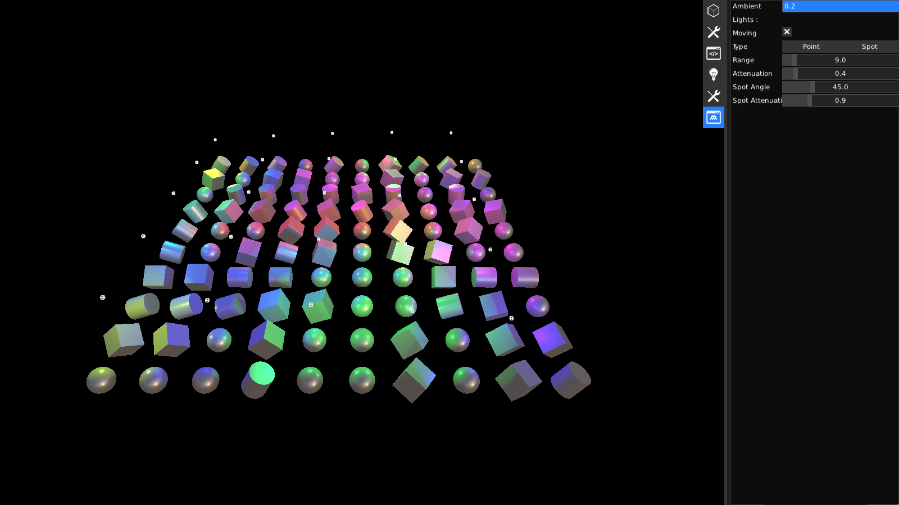
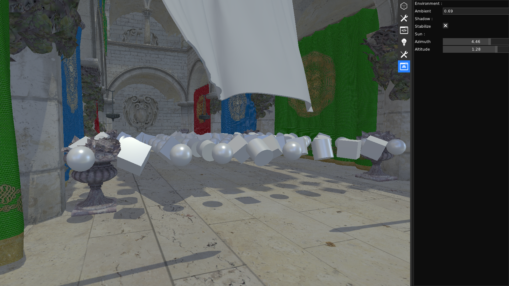
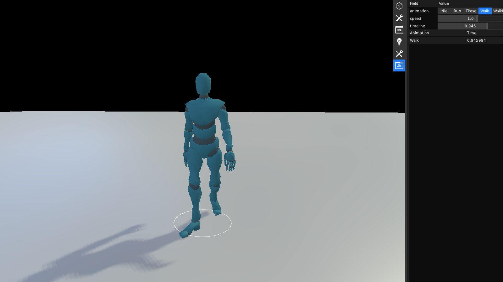
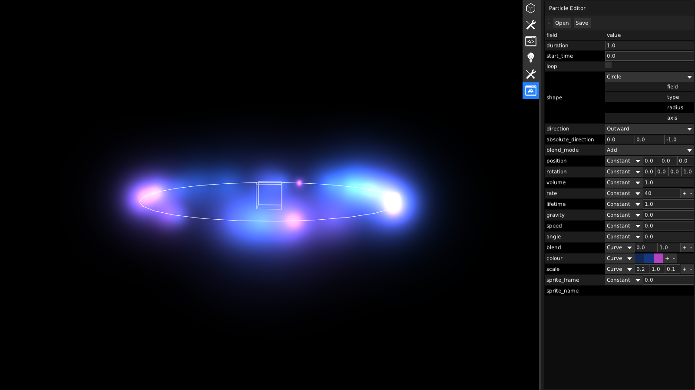
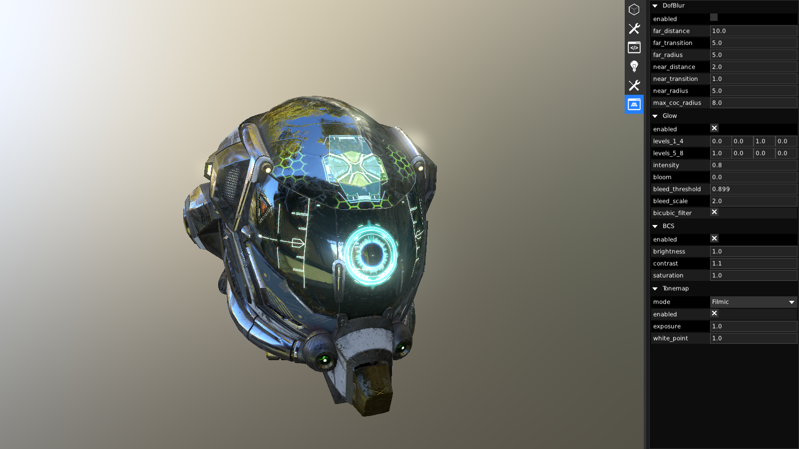
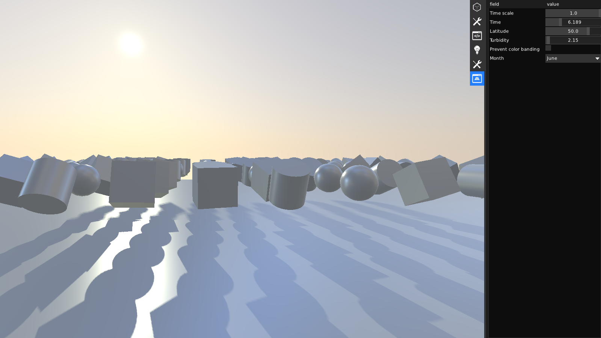
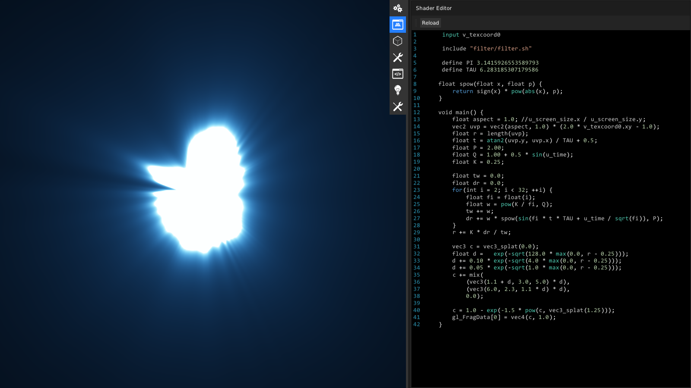
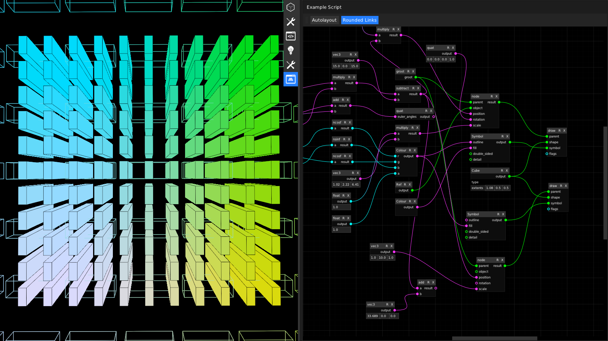

# [mud](https://github.com/hugoam/mud)
[mud](https://github.com/hugoam/mud) is an all-purpose c++ app prototyping library, focused towards live graphical apps and games.  
mud contains all the essential building blocks to develop lean c++ apps from scratch, providing [reflection](https://github.com/hugoam/mud#reflection) and low level [generic](https://github.com/hugoam/mud#generic-features) algorithms, an [immediate ui](https://github.com/hugoam/mud#ui) paradigm, and an immediate minimalistic and flexible [graphics renderer](https://github.com/hugoam/mud#graphics).

# [pbr materials](examples/03_materials_low.html)

# [lights](examples/04_lights.html)

# [sponza (.obj import)](examples/04_sponza.html)

# [character (animations)](examples/05_character.html)

# [particles](examples/06_particles.html)

# [gltf](examples/07_gltf.html)

# [sky (perez model)](examples/08_sky.html)

# [live shader](examples/09_live_shader.html)

# [live graphics](examples/14_live_gfx.html)

# [live graphics (visual script)](examples/14_live_gfx_visual.html)

